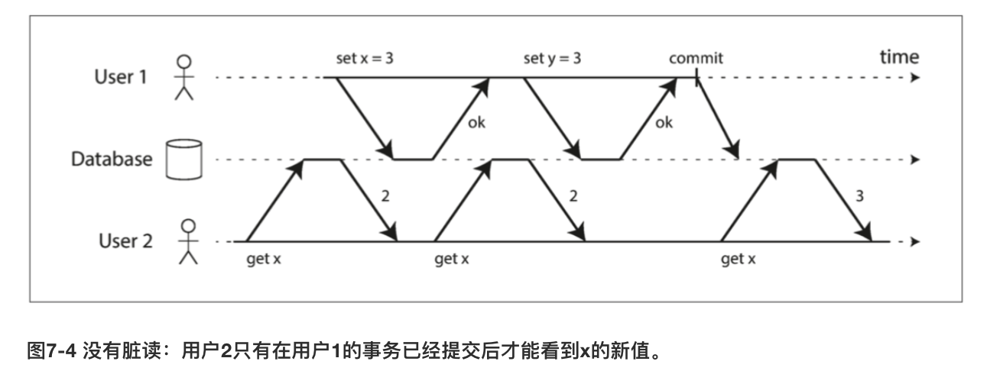
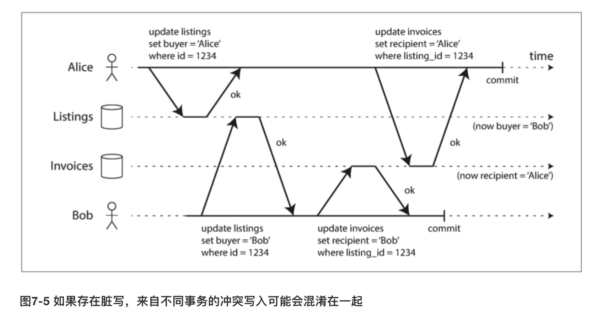
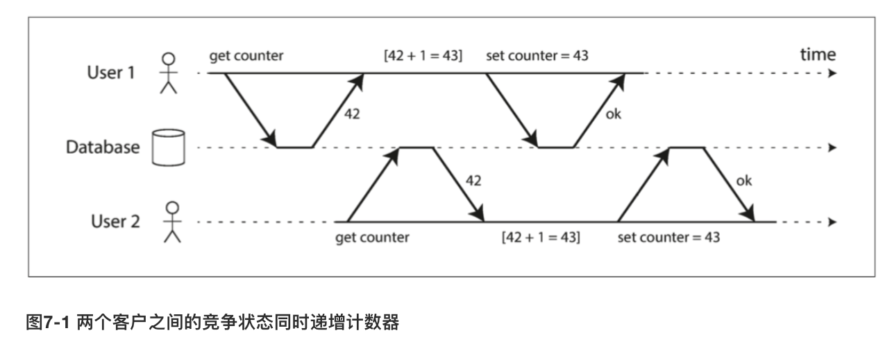
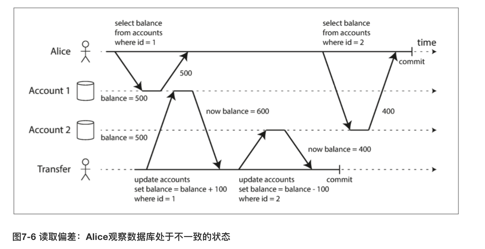
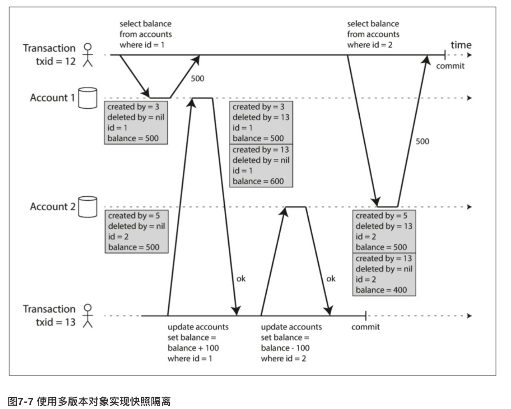
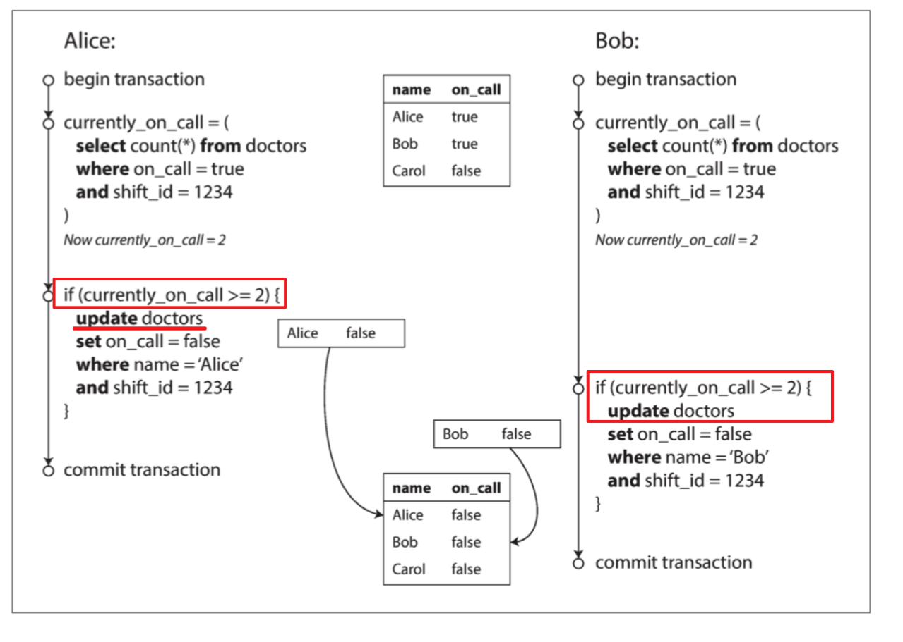

# 事务的隔离性

## 为什么会需要隔离性

如果**两个事务**不触及相同的数据，它们可以安全地并行（parallel） 运行，因为两者都不依赖于另一个。当一个事务读取由另一个事务同时修改的数据时，或者当两个事务试图同时修改相同的数据时，并发问题（**竞争条件**）才会出现。

## 先说概念

四种隔离级别：
- 读未提交
- 读已提交
- 可重复读
- 可串行化


## 各个隔离级别解决了什么问题？


### 读已提交


#### 脏读

##### 场景

读 x 1, 写 x 1（关键字：部分对象）：

```
init x=0, y=0

update x = 1
                get x = 1, y=0 (不一致)
update y = 2
commit

final: x = 1, y = 2
```


- 用户2可能看到**部分**用户1修改的数据，可能在**一致性**上不合法。比如用户看到新的未读电子邮件（对象1），但看不到更新的计数器（对象2）。
- 用户2如果事务中止需要**回滚**，用户1可能读到回滚前的数据。


##### 解决方法

- 读写锁？效果并不好，可能某一方长时间占用锁
- 临时变量保存写的对象，让读可以读这个var，避免读被写阻塞


#### 脏写


##### 场景

~~两个对同一个对象的写，后提交的数据覆盖了前面提交的数据~~

这里还和之前理解的不太一样。脏写真正的含义是，两个用户写入多个对象
```
update x = 1
                update x = 2
                update y = 2
update y = 1
final: x = 2, y = 1
```


##### 解决方法

- 行锁


##### 没有解决什么？（丢失更新）

典型的计数器递增，主要的错误是**读**的过程出了问题。
```
get x = 1
                get x = 1
update x += 1(2)
                update x += 1(2)
final: x = 2
```



以上的隔离级别基本解决了一些常见的麻烦。
- 读取不完整的事务结果
- 并排写入的并发

### 可重复读


持续时间长的事务，由于没有阻塞其他写，导致时间跨度较长的前后时间点读取的某个对象的数据不一致。




##### 场景

1. 备份，**持续时间长**。这段时间，肯定是接受写入操作的。如果想从这个备份进行恢复，那么不一致就会变成永久的。

2. 分析查询和完整性检查

##### 解决方案

- 快照隔离。MVCC。

##### what is MVCC?





1. **多版本**是指某个对象的某个版本
2. 一个事务一个id（txid，自增长）。
3. 每当一个事务写入内容，他所写入的数据都会标记上写入者的事务ID。（create_by, delete_by）

MVCC也可以用在读已提交上面，主要实现是保留两个版本的快照，为每个查询适用单独的快照


##### 索引在快照隔离上起作用

- 一种选择是使用索引简单的指向对象的**所有版本**，并通过索引查询**过滤**当前事务不可见的任何对象版本
- 也有一些数据库选用了仅追加的B-tree，每个写入的事务都创建新的树


### 防止丢失更新

只读事务 在 并发写入时看到什么？**读已提交、快照隔离。**

那么写事务进行并发写入呢？（计数器递增）

1. 原子写
    ```sql
    UPDATE counters SET value = value + 1 WHERE key = 'foo';
    ```
    游标稳定性（cursor stability）

2. 显式锁定
    `FOR UPDATE`对select返回的所有行**加锁**
    ```sql
    BEGIN TRANSACTION;
    SELECT * FROM figures
        WHERE name = 'robot' AND game_id = 222
    FOR UPDATE;

    -- 检查玩家的操作是否有效，然后更新先前SELECT返回棋子的位置。
    UPDATE figures SET position = 'c4' WHERE id = 1234;
    COMMIT;
    ```

3. 自动检测丢失的更新
    - 允许并发写入，写入过后对结果进行检查（中止事务，强制重试 read-update-commit）

4. 比较并设置（CAS）
    ```sql
    -- 根据数据库的实现情况，这可能也可能不安全
    UPDATE wiki_pages SET content = '新内容'
    WHERE id = 1234 AND content = '旧内容';
    ```
    也可能不安全，where从旧的快照中获取数据（MVCC带来的问题）

5. 冲突解决和复制（**分布式的场景**，多节点）
    - 复制数据库中，多对个『**兄弟**』值应用代码进行处理
    - 如果有可交换性，最终结果也能一致。例如，递增计数器或向集合添加元素是可**交换的操作**。
    - **最后写入为准**（LWW）的冲突解决方法很容易丢失更新。不幸的是，LWW是许多复制数据库中的默认值。


### 写入偏差与幻读

前面说的，**脏写、丢失更新**，主要是并发写入相同对象。那么不同对象呢（但又影响最终结果）？

**写入偏差**视为**丢失更新**问题的一般化。


#### 场景




```
get x
                get x
check x
                check x
update y
                update y

```

#### 为什么会出现写入偏差

幻读

所有这些例子都遵循类似的模式：

1. 一个SELECT查询找出符合条件的行，并检查是否符合一些要求。（例如：至少有两名医生在值班；不存在对该会议室同一时段的预定；棋盘上的位置没有被其他棋子占据；用户名还没有被抢注；账户里还有足够余额）

2. 按照第一个查询的结果，应用代码决定是否继续。（可能会继续操作，也可能中止并报错）

3. 如果应用决定继续操作，就执行写入（插入、更新或删除），并提交事务。

这个**写入**的效果改变了步骤2 中的先决条件。换句话说，如果在提交写入后，重复执行一次步骤1 的**SELECT**查询，将会得到**不同的结果**。因为**写入改变符合搜索条件的行集**（现在少了一个医生值班，那时候的会议室现在已经被预订了，棋盘上的这个位置已经被占据了，用户名已经被抢注，账户余额不够了）。

这些步骤可能以不同的顺序发生。例如可以首先进行写入，然后进行SELECT查询，最后根据查询结果决定是放弃还是提交。

在医生值班的例子中，在步骤3中修改的行，是步骤1中返回的行之一，所以我们可以通过锁定步骤1 中的行（**SELECT FOR UPDATE**）来使事务安全并避免写入偏差。但是其他四个例子是不同的：它们检查是否不存在某些满足条件的行，写入会添加一个匹配相同条件的行。**如果步骤1中的查询没有返回任何行，则SELECT FOR UPDATE锁不了任何东西**。

这种效应：**一个事务中的写入改变另一个事务的搜索查询的结果，被称为幻读**【3】。快照隔离避免了只读查询中幻读，但是在像我们讨论的例子那样的读写事务中，幻影会导致特别棘手的写歪斜情况。


总结：某些情况可以使用`SELECT FOR UPDATE`防止幻读，但是如果`SELECT FOR UPDATE`没有结果行，锁不住任何东西，潜在还是会出错。