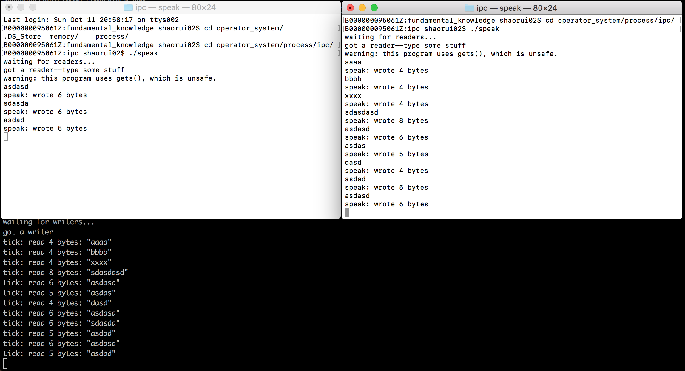

# ipc

[ref docs](http://beej.us/guide/bgipc/html/multi/index.html)
[comparing-unix-linux-ipc](https://stackoverflow.com/questions/404604/comparing-unix-linux-ipc)

###### > 如何选择，以什么作为考量？

[Message Boundary issue](https://stackoverflow.com/questions/404604/comparing-unix-linux-ipc): 
1. bytes stream: 抽象成`file stream` or `stdin/stdout`（linux的核心概念）, 需要知道**消息长度**
2. discrete protocols like **UDP** or **message queues**

Benchmark and Message Boundary: 
- **Pipe** I/O is the fastest but needs a **parent/child relationship** to work.
- Sysv IPC has a defined message boundary and can connect disparate processes locally, for example, **MQ**
- UNIX sockets can connect disparate processes **locally** and has **higher bandwidth** but no inherent message boundaries.
- TCP/IP sockets can connect any processes, even over the **network** but has **higher overhead** and no inherent message boundaries.

###### > ipc分类
- anonymous pipe: 
    - usage: cat file | grep word
    - 单向
    - [implement](https://github.com/shaorui0/tiny_shell/blob/master/pipe_demo.c).
- named pipe: 
    
    - 半双工
    - [some examples](http://beej.us/guide/bgipc/html/multi/fifos.html#fifonew)
- signal
    - fork + signal
    - [implement: tiny shell](https://github.com/shaorui0/tiny_shell)
- file lock
- Semaphores
    - 某种同步原语，当需要锁功能或者生产消费一定数量的资源时
- socket
    - 全双工，本机或网络
    - TODO web server
- mmap
    - [what is mmap?](https://github.com/shaorui0/fundamental_knowledge/tree/main/operator_system/memory/mmap)
        - mmap是什么？
        - 为什么需要mmap()
        - pros and cons
        - 一些可以运行的例子

- shared memory
