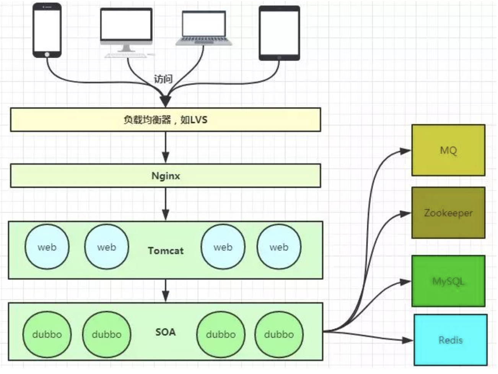
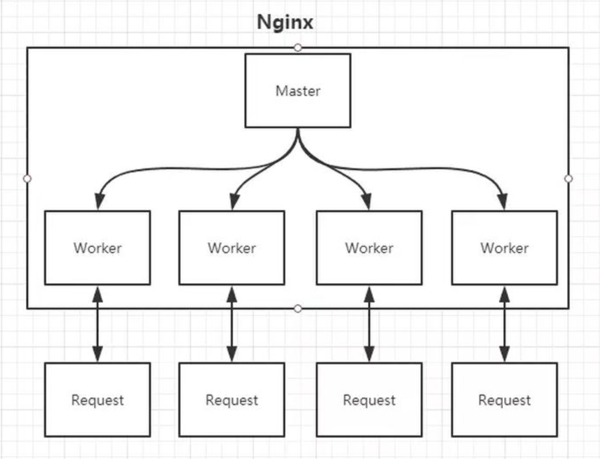

# what is NGINX?

### nginx.conf


[example link 1](https://www.nginx.com/resources/wiki/start/topics/examples/full/)
[example link 2](https://github.com/nginx/nginx/blob/master/conf/nginx.conf)
```
worker_processes  5;  ## Default: 1
error_log  logs/error.log;
pid        logs/nginx.pid;
worker_rlimit_nofile 8192;

events {
  worker_connections  4096;  ## Default: 1024
}

http {
  include    conf/mime.types;
  include    /etc/nginx/proxy.conf;
  include    /etc/nginx/fastcgi.conf;
  index    index.html index.htm index.php;

  default_type application/octet-stream;
  log_format   main '$remote_addr - $remote_user [$time_local]  $status '
    '"$request" $body_bytes_sent "$http_referer" '
    '"$http_user_agent" "$http_x_forwarded_for"';
  access_log   logs/access.log  main;
  sendfile     on;
  tcp_nopush   on;
  server_names_hash_bucket_size 128; # this seems to be required for some vhosts

  server { # php/fastcgi
    listen       80;
    server_name  domain1.com www.domain1.com;
    access_log   logs/domain1.access.log  main;
    root         html;

    location ~ \.php$ {
      fastcgi_pass   127.0.0.1:1025;
    }
  }

  server { # simple reverse-proxy
    listen       80;
    server_name  domain2.com www.domain2.com;
    access_log   logs/domain2.access.log  main;

    # serve static files
    location ~ ^/(images|javascript|js|css|flash|media|static)/  {
      root    /var/www/virtual/big.server.com/htdocs;
      expires 30d;
    }

    # pass requests for dynamic content to rails/turbogears/zope, et al
    location / {
      proxy_pass      http://127.0.0.1:8080;
    }
  }

  upstream big_server_com {
    server 127.0.0.3:8000 weight=5;
    server 127.0.0.3:8001 weight=5;
    server 192.168.0.1:8000;
    server 192.168.0.1:8001;
  }

  server { # simple load balancing
    listen          80;
    server_name     big.server.com;
    access_log      logs/big.server.access.log main;

    location / {
      proxy_pass      http://big_server_com;
    }
  }
}
```


## 如何工作？

### 常见业务架构



#### 如何做到**热部署**

###### nginx 做法：
1. Change nginx.conf
2. The changes take effect
    - new some workers, new requests => new workers.
    - old workers **continue** to handle unfinished requests. If a old worker completes the **remaining** requests, **KILL** it.

###### 还有可能的方案：

修改配置文件nginx.conf后，主进程master负责推送给woker进程更新配置信息，woker进程收到信息后，更新进程内部的线程信息。（有点 valatile 的味道）


## 功能

### 0. 虚拟主机



#### 为什么要加一层 nginx，而不直接通过后端的路由（框架，比如Django）进行 serve ？

核心问题其实是**为什么需要这样一个 server ， 『业务逻辑』不在 server 上面**。
1. 通过`location`配置正则表达式，将 request.URL 快速匹配到对应 static file 上。
2. 为什么能提高速度？**动静分离**，静态资源给 Nginx 管理，**动态请求**（就是上面的主要业务逻辑）**转发**给后端。比如 `index.html`。
3. 静态资源包括 业务数据 和 日志数据，归属到不同域名下（目录），方便维护。
4. IP 控制访问，比如 **black list / white list** ，部分 request 不需要转给 server

### 1. 反向代理

location:
- root: 静态返回
- proxy_pass: 动态转发


### 2. 负载均衡

- upstream: nginx 定义**一组**后端服务，通过一些 LB 策略进行**负载均衡**，同时进行**健康检查**。
- proxy_pass => upstream

##### 负载均衡有哪些策略？

（IPHASH、加权论调、最少连接......）

https://github.com/shaorui0/tiny_load_balancer


#### pros

显而易见，可以 scale up ，部署更多的 server 来处理 request 。

#### cons

本质还是『**不一致**』的问题。web 层面，比如用户的 session 信息不一致。（由于 request 经过 lb 到达不同的 server 端）

#### 从 tiny_lb 中学到什么？

1. 反向代理是什么东西？
本质是**解耦**，client 不知道 server 的 IP ， server 不知道 client 的 IP。两者都经过第三方 reverse_proxy_server ，更符合直觉。
2. 正向代理是什么东西？
典型的应用场景就是**VPN**，client 知道 server 的 IP，但是中间是通过第三方绕过了 WALL，对 client 透明，server 获取到的 IP 是 **VPN_server.IP**。


### 3. 缓存

TODO

### 怎么进行高并发

1. 本质上是设计的优秀，eventloop
2. Master - Worker(1 - n)


### 怎么进行高可用

keepalive + nginx：keppalive 监控 nginx 的生命，防止单点 nginx 挂掉。
