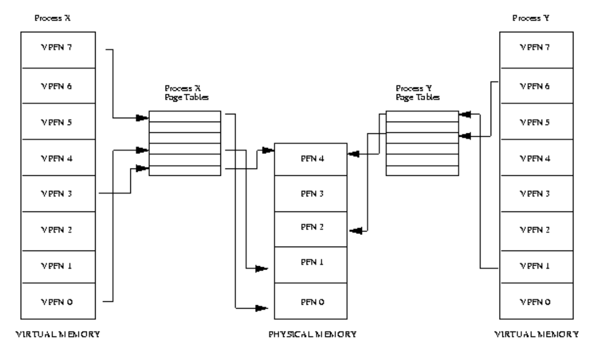
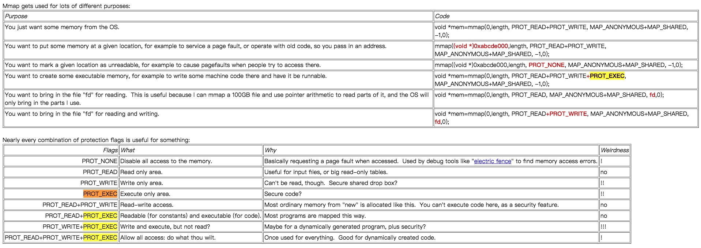

# what is mmap

## 从哪里知道的这个概念？

1. 《CSAPP》中，web server使用了这个函数。（静态html文件读入）

```c
void server_static(fd, filename, filesize){
    ...

    /* send response body to client*/
    open static file
    mmap static file content to memory
    write static file content to client
    munmap
}

```

2. 个人项目[Tiny Shell](插入链接)中涉及到**进程间通信**的概念（使用的signal）。这里学习另一种进程间通信的方式。

## why mmap

一个手段/方法产生，使用历史原因的。一定是有了需求，才会产生解决方法。mmap是什么？
mmap是一种进程读取文件的方式，直接从disk读取（抽象过程），那么之前是怎么进程怎么读取数据？ **Malloc**: `Disk <=> Memory <=> Os buffer <=> Addr space`。
这个过程由于buffer的存在，io次数会显著增加（特别是大文件读写）。mmap典型的优点就是不与buffer打交道，直接对disk上的文件进行**映射**。

[TODO 进程地址空间]


## what is mmap

- private/shared
- file/anonymous

## mmap如何进行『内存管理』？

需要提到内存管理中**page**的概念。同时也因为这个原因，小文件读取优势就没有了。（比如：32bits机器字长，一个page4KB，一个文件31bytes，该页其他空间就浪费了。）


## pros and cons

### pros

1. 大文件的读取，直接映射，避免bother buffer。同时除了可能的[TODO CSAPP page fault](xxx)，一般不会出现其他系统调用问题和进程上下文转换。
    - 一般的IO过程是`open()`/`read()`/`write()`，OS对其进行管理的时候都会加上Buffer（[TODO 避免频繁打扰CPU](xxxinvalid)）。
    - malloc里面如果有大量数据读取，也会调用mmap（数据量小则调用`sbrk()`）。
    - OS knows how to **restore** them from the existing file they were mmap'd from. 

2. IPC很方便（文件映射/非匿名映射），类似**共享内存**[linux-shared-memory-shmget-vs-mmap](https://stackoverflow.com/questions/21311080/linux-shared-memory-shmget-vs-mmap)，以及[where-is-linux-shared-memory-actually-located](https://stackoverflow.com/questions/21325001/where-is-linux-shared-memory-actually-located)。一块内存被多个进程所共享，读写都会写入到最终地址（COW），需要自己使用同步原语(synchronization primitives )。

    


3. 匿名map是指对某个区域进行二进制0的初始化，优点类似`malloc` + `mmset`，也确实有这样的应用，不与磁盘交互，只在内存中进行io

### cons

1. 【小文件内存浪费】32bits机器字长，一个page4KB，一个文件31bytes，该页其他空间就浪费了。
2. 【碎片问题】同样32bit机器字长的场景下，由于mmap会寻找连续的内存空间，那么内核会以某种手段去找到一个连续地址。这样多次mmap，**碎片**问题会比较严重。
3. 【经常需要自己指定start addr / offset】Another potential awkwardness with mmap as a replacement for read / write is that you have to start your mapping on offsets of the page size. If you just want to get some data at offset X you will need to fixup that offset so it's compatible with mmap.
3. 【某些io类型不支持】read / write are the only way you can work with some types of files. mmap can't be used on things like pipes and ttys.

## 使用场景


来自：https://www.cs.uaf.edu/2016/fall/cs301/lecture/11_02_mmap.html

### 简单的几个例子

[some simple examples in my github](https://github.com/shaorui0/fundamental_knowledge/tree/main/operator_system/memory/mmap)


---

#### 其他参考


https://stackoverflow.com/questions/26259421/use-mmap-in-c-to-write-into-memory
https://stackoverflow.com/questions/258091/when-should-i-use-mmap-for-file-access
https://stackoverflow.com/questions/5877797/how-does-mmap-work