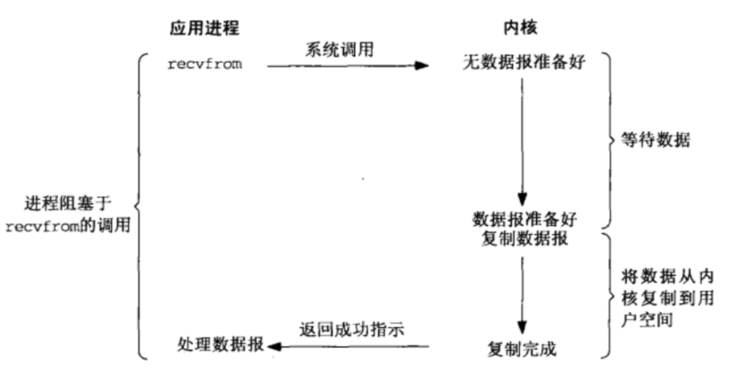
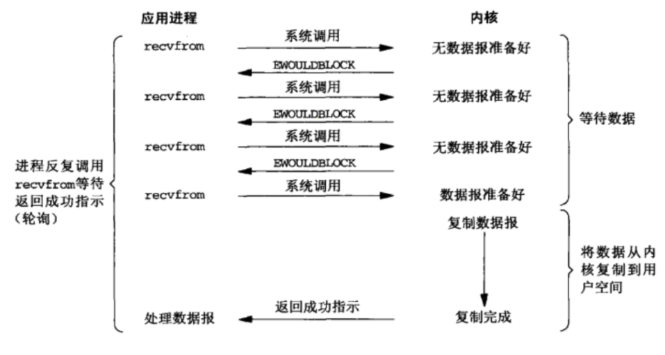

# event driven model

## why need event driven model

> In a sense, this isn't really different from what you might do with threaded I/O, **but it has much reduced overhead in the form of memory, context switching, and general "housekeeping", and takes maximum advantage of what operating systems do best** (or are supposed to, anyway): **handle I/O quickly.**

事件驱动模型必须配合使用非阻塞IO，不然当前进程/线程会花大量的时间去等待（相比于真正的处理时间）。非阻塞io，在不可用时（包括缓冲区满、request还没有到来），会产生`EWOULDBLOCK`，此时会出让资源（如CPU）给其他任务。

- blocking io

- non-blocking io

- [diff multi-process / multi_thread / io_reuse](https://github.com/shaorui0/fundamental_knowledge/tree/main/operator_system/process/diff_multi-process-multi_thread-io_resue.md)

- [stackoverflow: how-does-event-driven-i-o-allow-multiprocessing](https://stackoverflow.com/questions/3231018/how-does-event-driven-i-o-allow-multiprocessing)

## how to implement a event driven model

### a simple reactor

- [server](./echo_server_event_driven.py)

- [client](./echo_client.py)